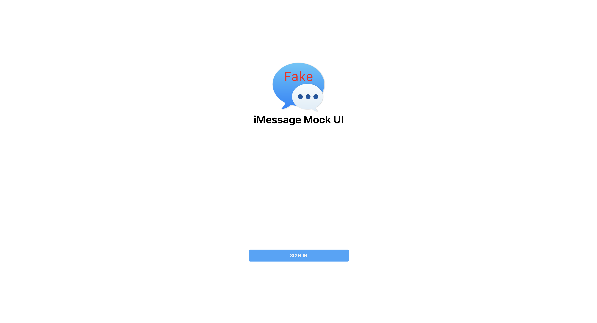
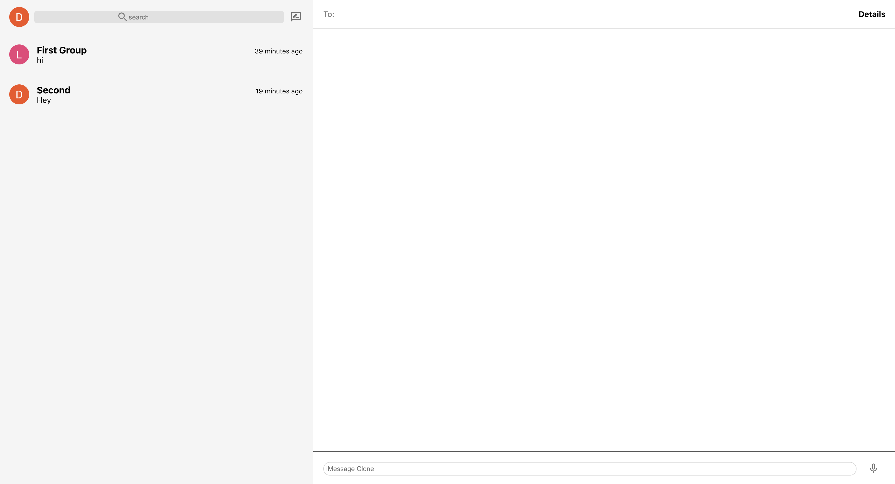

# **Mock iMessage Backend**

### Click the link to view the website

[Mock iMessage UI Website](https://i-message-ui.web.app/)

### About Us

##### Mock iMessage Backend built utilizing Express, Mongoose, cors, .env files, and more...

#### Project Work:

##### https://github.com/davesheinbein

#### LinkedIn:

##### https://www.linkedin.com/in/david-sheinbein/

## Screenshot:

[Login Page Screenshot](https://imgur.com/u3TSqIH)

[Home Page Screenshot](https://imgur.com/pU6fTS5)

## Technologies Used:

##### 1. Express

##### 2. Mongoose

##### 3. JavaScript

##### 4. cors

##### 5. .env

##### 6. React

##### 7. Node.js

##### 8. Heroku

##### 9. Git

##### 10. Github

## Potential Next Steps:

##### - [] Update server for further backend interactions

### Click the link to view David Sheinbeins Portfolio website

[David Sheinbein's Portfolio Webstite](http://www.davidsheinbeinportfolio.com/)
