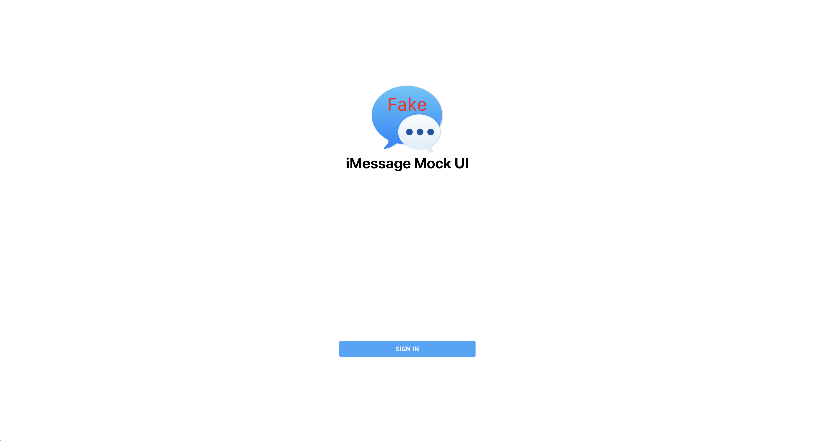

# **iMessage Mock Frontend UI**

### Click the link to view the website

[iMessage Mock Frontend UI Website](https://i-message-ui.web.app/)

### About Us

##### Mock iMessage Frontend UI built utilizing React, Redux, SASS, and more. Deployed to Firebase utilizing Firebase database and user authentication.

#### Project Work:

##### https://github.com/davesheinbein

#### LinkedIn:

##### https://www.linkedin.com/in/david-sheinbein/

## Screenshot:

[Login Page Sceenshot](https://imgur.com/u3TSqIH)

[Home Page Sceenshot](https://imgur.com/pU6fTS5)

## Technologies Used:

##### 1. HTML5

##### 2. CSS

##### 3. Sass

##### 4. JavaScript

##### 5. Redux

##### 6. React

##### 7. Node.js

##### 8. timeago.js

##### 9. react-flip-move

##### 10. Firebase

##### 11. Firebase Database

##### 12. Firebase Authentication

##### 13. CurrencyFormat

##### 14. Git

##### 15. Github

## Potential Next Steps:

##### - [X] Update CSS further to make responsive on all size screens

##### - [] Make chat scroll to bottom upon sending message

### Click the link to view David Sheinbeins Portfolio website

[David Sheinbein's Portfolio Webstite](http://www.davidsheinbeinportfolio.com/)
